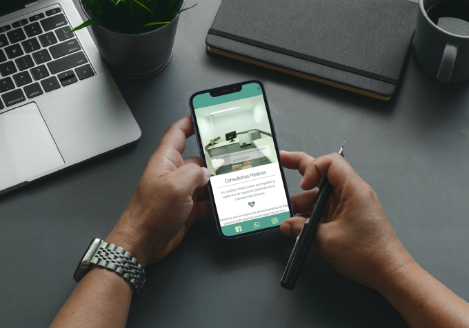
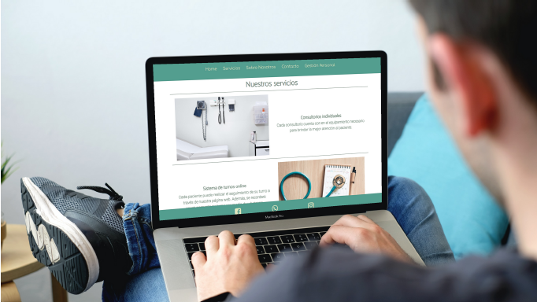
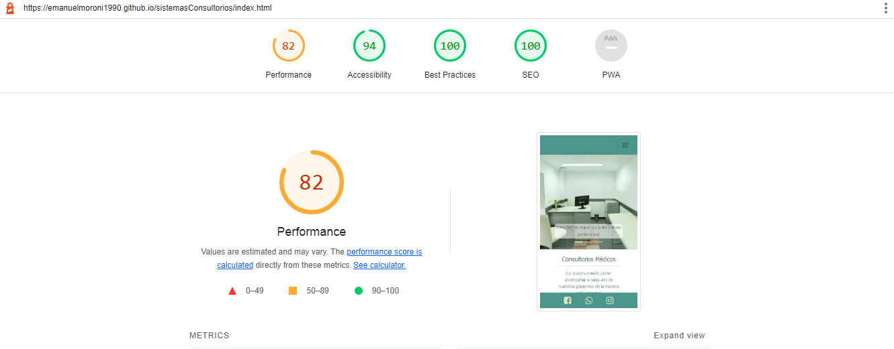

# Sistema de gestión de consultorios privados
> Desarrollado por Emanuel Moroni

## Entrega final - 28/03/2022

Se adjunta un archivo de rúbrica en donde se hace un seguimiento de los items pedidos.

* Imágenes representativas del desarrollo final

## Comentarios sobre la sexta entrega - 03/03/2022

* Utilización de maps:
    - En el archivo _navbar.scss se utiilza un mapa para definir los colores que corresponden a los íconos de footer cuando sobre los mismos se encuentra el cursor. Los colores se corresponden con sus respectivos valores empleados en las redes sociales.

* Utilización de extends:
    - En el archivo _form.scss se utiliza un extend para que la clase form__contacto herede de la clase form__login todas sus propiedades. En la entrega anterior estas clases se desarrollaron por separado y se podía ver con claridad cuan similares resultaron. Por este motivo se aplicó el extend y se colocaron las propiedades particulares sobre la clase form__contacto.

* Utilización de mixins:
    - El recurso mixins se utilizó a lo largo de todo el desarrollo motivo por el que se creó un nuevo parcial con el nombre de _mixins.scss. Fueron creados los siguientes,
        1. flexFormat
        2. textFormat
        3. imgFormat

* Desarrollo de SEO:
    - Utilización de descripción. Se colocó la siguiente descripción, "Consultorios médicos privados. Sistema de gestión integrado para el seguimiento personalizado de pacientes."
    - Utilización de keywords. Se colocaron en los archivos index, nosotros y contacto.html las siguientes palabras clave, consultorios médicos, consultorios medicos, turnos, paciente y medicina. En los archivos restantes se colocaron consulta, contacto y sistema de gestión.
    - Se modificaron los títulos de alta_usuario, contacto y login.html.
    - Todas las páginas cuentan con un título implementado con un h1. Y, además, servicios.html cuenta con los encabezados h3 en donde se listan los servicios brindados.

* Reporte Ligth House:

## Comentarios sobre la cuarta y quinta entrega - 24/02/2022

Se respeta el comportamiento de la presentación anterior pero empleando las herramientas estudiadas en la clase de SASSI. Además, se agrega el formulario para que el usuario se de alta.

## Comentarios sobre la cuarta y quinta entrega - 11/02/2022

* Transiciones:
1. Las transiciones aplicadas son de AOS y se pueden ver en los elementos del inedx.html y servicios.html. Sobre todo los mismos toman mayor apreciación en la versión mobile.

* Bootstrap:
Una de las primeras modificaciones necesarias para su implementación fue el ajuste de las clases empladas previamente para que el desarrollo pueda convivir con lo ya realizado.
1. Se implementó la navbar logrando que la misma colapse cuando se encuentra por debajo del breakpoint establecido.
2. En la ventana principal se utilizó un carousel con imágenes representativas del servicio brindado por los consultorios.
3. El sistema de contacto y de login de usuario se desarrollaron empleando los formularios del framework.

* Comentarios:
El botón que se utiliza para cuando el menú colapsa se colocó a la derecha para que oportunamente se pueda poner en el logotipo del proyecto. Tanto en el inspector en modo PC como en diferentes dispostivos mobile el mismo se encuentra en esa posición. Pero cuando se visualiza el proyecto hosteado, el botón está en la izquierda.
Queda como punto de mejora para los siguientes avances reemplazar la sección de about us del proyecto.